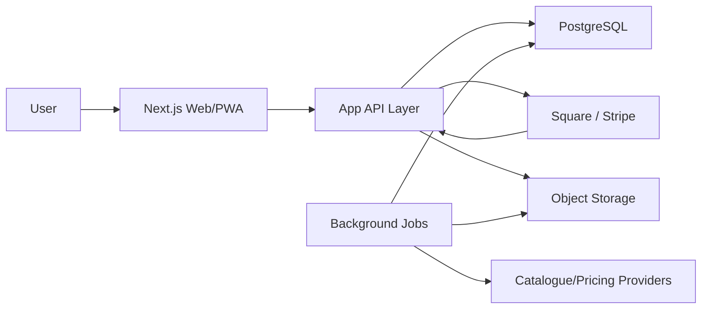

# PokeStop Architecture

## Purpose

This document defines the recommended technical architecture for the first build. It is intentionally practical: strong enough for a monetized product, but not overbuilt before the MVP proves demand.

## Architecture Decision

Build the MVP as a mobile-first Next.js web app/PWA backed by PostgreSQL.

Recommended stack:

- App: Next.js with TypeScript.
- UI: React components with a small design system.
- Database: PostgreSQL.
- ORM: Prisma.
- Auth: Auth.js or a managed auth provider if speed becomes more important than vendor independence.
- Payments: Square by default, with Stripe retained as a fallback provider.
- Background jobs: scheduled worker runner for catalogue sync and price snapshots.
- File storage: S3-compatible storage for future uploads and generated reports.
- Hosting: Vercel or similar for the web app, managed PostgreSQL for the database.

Why this stack:

- Fast path to a polished web/PWA.
- Strong TypeScript coverage across UI and backend.
- Good fit for later mobile app APIs.
- Mature support for subscriptions, webhooks, scheduled jobs, and database migrations.

## Guiding Principles

- Web/PWA first, mobile apps later.
- Keep catalogue, collection, pricing, and subscription logic separate.
- Treat external data providers as replaceable.
- Avoid building advanced features before the core collection flow feels excellent.
- Keep user data exportable.
- Make Plus gates entitlement-based, not hardcoded UI tricks.

## System Overview



## Application Layers

### UI Layer

Responsibilities:

- Dashboard.
- Collection browsing.
- Add/edit item flows.
- Wishlist.
- Set progress.
- Analytics gate and Plus screens.
- Settings and import/export.

Guidelines:

- Mobile-first layout.
- Persistent bottom navigation on mobile.
- Clear empty states.
- Fast add flow with minimal required fields.
- Avoid marketing-heavy screens inside the authenticated app.

### API Layer

Responsibilities:

- Validate input.
- Check authentication.
- Check subscription entitlements.
- Perform database reads/writes.
- Return normalized response shapes.
- Hide provider-specific data from UI where possible.

The API should expose stable app concepts:

- Cards.
- Sets.
- Sealed products.
- Collection items.
- Wishlist items.
- Analytics summaries.
- Subscriptions.
- Imports/exports.

### Domain Layer

Responsibilities:

- Collection value calculation.
- Set completion calculation.
- Duplicate detection.
- Entitlement checks.
- Price confidence scoring.
- Import validation.

This logic should live outside React components so it can be reused by API routes, background jobs, and future mobile APIs.

### Data Layer

Responsibilities:

- Database schema.
- ORM models.
- Migrations.
- Query helpers.
- Transaction boundaries.

Keep provider raw data in `metadata` fields, but promote important fields into first-class columns.

### Job Layer

Responsibilities:

- Catalogue sync.
- Price snapshot refresh.
- Report generation.
- Import processing later.
- Cleanup and maintenance tasks.

MVP can start with simple scheduled jobs. If job volume grows, move to a dedicated queue.

## Suggested Project Structure

```text
src/
  app/
    (auth)/
    (dashboard)/
    api/
  components/
    ui/
    collection/
    catalogue/
    dashboard/
    wishlist/
  features/
    analytics/
    catalogue/
    collection/
    pricing/
    subscriptions/
    wishlist/
  lib/
    auth/
    db/
    env/
    money/
    validation/
  jobs/
    catalogue-sync/
    pricing-refresh/
  styles/
prisma/
  schema.prisma
  migrations/
docs/
  adr/
```

Notes:

- `features/` holds domain-specific code.
- `components/ui/` holds reusable interface primitives.
- `lib/` holds cross-cutting helpers.
- `jobs/` holds scheduled and worker logic.
- `docs/adr/` can hold small architecture decision records later.

## MVP Route Map

Authenticated app routes:

- `/dashboard`
- `/collection`
- `/collection/new`
- `/collection/:id`
- `/sets`
- `/sets/:id`
- `/wishlist`
- `/analytics`
- `/settings`
- `/settings/billing`
- `/settings/import-export`

Public/auth routes:

- `/`
- `/login`
- `/signup`
- `/pricing`

Admin routes:

- `/admin/catalogue`
- `/admin/sealed-products`
- `/admin/pricing`

Admin routes can be hidden until needed but should use role checks from day one.

## API Surface

Initial API groups:

### Auth And User

- Get current user.
- Update profile preferences.
- Delete account later.

### Catalogue

- Search cards.
- Search sealed products.
- Get card detail.
- Get sealed product detail.
- Get sets.
- Get set detail with printings.

### Collection

- List collection items.
- Create collection item.
- Update collection item.
- Archive/remove collection item.
- Get collection item detail.

### Wishlist

- List wishlist items.
- Create wishlist item.
- Update wishlist item.
- Remove wishlist item.
- Move wishlist item to collection.

### Analytics

- Dashboard summary.
- Set completion summary.
- Duplicate summary.
- Value summary.
- Plus-only deeper analytics.

### Billing

- Create checkout session.
- Create billing portal session.
- Receive billing provider webhook.
- Read entitlement state.

### Import And Export

- Export collection CSV.
- Import collection CSV later.
- Download generated report later.

## Entitlement Model

The app should centralize Plus checks.

Example entitlement names:

- `analytics.full`
- `pricing.history`
- `pricing.alerts`
- `duplicates.advanced`
- `wishlist.advanced`
- `storage.advanced`
- `exports.insurance_report`
- `imports.csv`

Free users can see gated entry points, but the backend must enforce access too.

Rules:

- UI gates are for clarity.
- API gates are for security.
- Square or Stripe webhooks update `subscriptions`.
- `subscriptions` determines active access.
- Grace periods can be handled through `current_period_end`.

## Catalogue Strategy

Catalogue data should be normalized into local tables.

Flow:

1. Fetch data from provider.
2. Map provider fields into local model.
3. Upsert `card_sets`.
4. Upsert `card_printings`.
5. Store provider-specific data in `provider_ids` and `metadata`.

Why local catalogue tables matter:

- Faster search.
- Stable IDs for user-owned items.
- Less dependency on provider availability.
- Ability to add sealed products and manual corrections.

## Pricing Provider Strategy

Pricing providers should use a common interface.

Conceptual interface:

```ts
type PriceLookupInput = {
  itemType: "card" | "sealed_product";
  cardPrintingId?: string;
  sealedProductId?: string;
  condition?: string;
  language?: string;
  variantLabel?: string;
  gradedCompany?: string;
  gradedScore?: number;
  currency: string;
};

type PriceLookupResult = {
  source: string;
  priceMinor: number;
  currency: string;
  confidenceScore: number;
  sampleSize?: number;
  observedAt: Date;
  metadata?: Record<string, unknown>;
};
```

Provider rules:

- Store raw provider response only in metadata.
- Do not expose provider quirks directly to UI.
- Cache every usable result as a `price_snapshots` row.
- Prefer transparent "unknown" over low-quality guesses.

## Value Calculation

Value calculation should be deterministic and testable.

For each collection item:

1. Use manual override if present.
2. Otherwise find the most recent matching price snapshot.
3. Multiply unit price by quantity.
4. Return unknown if no price exists.

For dashboard totals:

- Sum known values by currency.
- Show count of unvalued items.
- Show cost basis only where purchase price exists.
- Do not silently convert currencies until an exchange-rate plan exists.

## Security And Privacy

Minimum requirements:

- Every user-owned query must scope by `user_id`.
- Admin routes require explicit admin role.
- Billing webhooks require provider signature verification.
- Environment secrets must never be committed.
- CSV export requires authenticated ownership.
- Public sharing must be opt-in.
- Account deletion must eventually remove or anonymize user data.

## Observability

MVP should include lightweight operational visibility:

- Server error logging.
- Billing webhook logging.
- Background job run logs.
- Import error reporting.
- Basic performance monitoring later.

Do not add a heavy observability stack before beta unless issues demand it.

## Testing Strategy

### Unit Tests

Focus on:

- Value calculation.
- Set completion.
- Duplicate detection.
- Entitlement checks.
- Price confidence scoring.
- Import row validation.

### Integration Tests

Focus on:

- Collection CRUD.
- Wishlist to collection flow.
- Subscription webhook handling.
- Catalogue import mapping.

### UI Tests

Focus on:

- Add first card.
- Add sealed product.
- View dashboard.
- Wishlist flow.
- Plus gate behavior.

### Manual QA

Before beta, verify:

- Mobile layout.
- Empty states.
- Error states.
- Slow network states.
- CSV export accuracy.

## Deployment Strategy

Recommended environments:

- Local development.
- Preview deployments per branch or pull request.
- Production.

Environment variables:

- Database URL.
- Auth secrets.
- Square access token, location ID, plan variation IDs, and webhook signature key.
- Optional Stripe keys and Stripe webhook secret if using the fallback provider.
- Storage credentials.
- Provider API keys.

Deployment principles:

- Run migrations before production deploy.
- Keep seed/catalogue import scripts repeatable.
- Never use production secrets locally.
- Use preview environments for risky UI or billing changes.

## Mobile App Path

The first mobile app should reuse:

- Same database.
- Same auth provider.
- Same API/domain logic.
- Same entitlement model.
- Same pricing and catalogue services.

Likely future route:

1. Ship web/PWA MVP.
2. Learn which flows users repeat most.
3. Build Expo app around those flows.
4. Keep web app as admin/import/export-friendly surface.

## First Build Sequence

Recommended order once coding begins:

1. Scaffold Next.js app with TypeScript.
2. Add linting, formatting, and base UI primitives.
3. Add Prisma and PostgreSQL schema.
4. Add auth.
5. Seed or import a small catalogue slice.
6. Build collection CRUD.
7. Build dashboard summary.
8. Build wishlist.
9. Build set progress.
10. Add CSV export.
11. Add subscription entitlements.
12. Add Square checkout and webhooks.

## Open Architecture Decisions

- Auth.js versus managed auth.
- Prisma versus Drizzle.
- Vercel versus another host.
- Neon, Supabase, Railway, or another PostgreSQL host.
- Job runner choice.
- Whether to use REST, tRPC, or server actions for the main API.
- Whether admin tools ship inside the main app or behind a separate admin area.

## Current Recommendation

Use this as the starting implementation choice:

- Next.js with TypeScript.
- PostgreSQL.
- Prisma.
- Auth.js unless managed auth is preferred for speed.
- Square by default, with Stripe fallback retained.
- Local provider abstraction for catalogue and pricing.
- Web/PWA MVP first.

This keeps the first build familiar, testable, and flexible without spending the project's early energy on infrastructure theatre.
