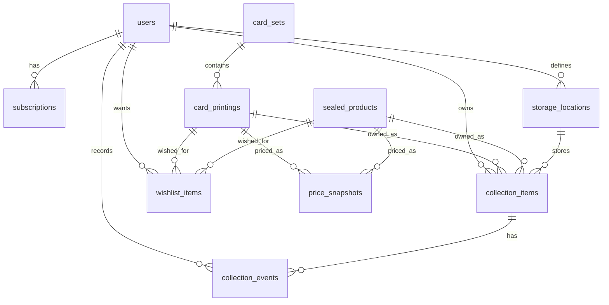

# PokeStop Data Model

## Purpose

This document turns the MVP data model into an implementation-ready database plan. It is still allowed to evolve, but the core shape should be stable enough to guide the first build.

The model is designed around four realities:

- Pokemon card catalogue data is different from a user's owned collection.
- One user may own several copies of the same card with different condition, language, grade, purchase price, or storage location.
- Sealed products need first-class support, including manual user-created entries.
- Pricing data should be cached and source-aware because external providers can change.

## Recommended Database

Use PostgreSQL for the MVP.

Reasons:

- Strong relational integrity for collection ownership and catalogue data.
- Good JSON support for provider metadata and variant details.
- Good indexing and query performance for search/filter screens.
- Compatible with common hosting providers and ORMs.

Use UUID primary keys for app-owned records. Keep external provider IDs in dedicated mapping fields rather than using them as primary keys.

## Naming Conventions

- Table names: plural snake_case.
- Primary key: `id`.
- Foreign keys: `{singular_table_name}_id`.
- Timestamps: `created_at`, `updated_at`.
- Soft deletion only where user-facing recovery or audit value is useful.
- Monetary values stored as integer minor units where possible, for example pence or cents.
- Currency stored as ISO-style text such as `GBP` or `USD`.

## Relationship Overview

## Core Tables

### users

Stores app user profiles. Authentication provider-specific details may live in the auth system, but the app should keep a local profile row for preferences and relationships.

| Column | Type | Notes |
| --- | --- | --- |
| id | uuid | Primary key. |
| email | text | Unique, normalized lowercase. |
| display_name | text | Optional. |
| preferred_currency | text | Default `GBP` for UK users, configurable. |
| preferred_region | text | Optional, for pricing and marketplace defaults. |
| role | user_role | Defaults to `user`; admin users are rare. |
| created_at | timestamp | Required. |
| updated_at | timestamp | Required. |

Indexes:

- Unique index on `email`.

### subscriptions

Stores the current billing entitlement state. Stripe remains the billing source of truth, but the app reads from this table for gates and UI.

| Column | Type | Notes |
| --- | --- | --- |
| id | uuid | Primary key. |
| user_id | uuid | References `users.id`. |
| provider | text | Usually `stripe`. |
| provider_customer_id | text | Stripe customer ID. |
| provider_subscription_id | text | Stripe subscription ID. |
| plan | subscription_plan | `free`, `plus_monthly`, `plus_yearly`. |
| status | subscription_status | `active`, `trialing`, `past_due`, `canceled`, etc. |
| current_period_end | timestamp | Used for access grace. |
| cancel_at_period_end | boolean | Defaults to false. |
| created_at | timestamp | Required. |
| updated_at | timestamp | Required. |

Indexes:

- Index on `user_id`.
- Unique index on `provider_subscription_id` where not null.
- Unique index on `provider_customer_id` where not null.

### card_sets

Stores normalized Pokemon card set data.

| Column | Type | Notes |
| --- | --- | --- |
| id | uuid | Primary key. |
| provider_ids | jsonb | External IDs keyed by provider, for example `{ "pokemon_tcg_api": "sv1" }`. |
| name | text | Set name. |
| series | text | Series name. |
| release_date | date | Optional. |
| printed_total | integer | Printed card count if available. |
| total | integer | Full card count if available. |
| symbol_image_url | text | Optional. |
| logo_image_url | text | Optional. |
| metadata | jsonb | Provider-specific extras. |
| created_at | timestamp | Required. |
| updated_at | timestamp | Required. |

Indexes:

- Index on `name`.
- Index on `series`.
- GIN index on `provider_ids`.

### card_printings

Stores individual card printings. A Charizard in one set and a Charizard in another set are separate rows.

| Column | Type | Notes |
| --- | --- | --- |
| id | uuid | Primary key. |
| card_set_id | uuid | References `card_sets.id`. |
| provider_ids | jsonb | External IDs keyed by provider. |
| name | text | Card name. |
| number | text | Card number, text because formats vary. |
| rarity | text | Optional. |
| supertype | text | Pokemon, Trainer, Energy, etc. |
| subtypes | text[] | Optional. |
| artist | text | Optional. |
| image_small_url | text | Optional. |
| image_large_url | text | Optional. |
| legalities | jsonb | Optional. |
| variant_metadata | jsonb | Holo, reverse, stamped, promo, or provider-specific flags. |
| search_text | text | Denormalized search helper. |
| created_at | timestamp | Required. |
| updated_at | timestamp | Required. |

Indexes:

- Index on `card_set_id`.
- Index on `name`.
- Index on `(card_set_id, number)`.
- Full-text or trigram index on `search_text`.
- GIN index on `provider_ids`.

### sealed_products

Stores sealed products such as booster boxes, ETBs, tins, blister packs, booster packs, and collection boxes.

| Column | Type | Notes |
| --- | --- | --- |
| id | uuid | Primary key. |
| created_by_user_id | uuid | Nullable. If set, this is a user-created product. |
| related_card_set_id | uuid | Nullable reference to `card_sets.id`. |
| provider_ids | jsonb | External IDs keyed by provider. |
| name | text | Product name. |
| product_type | sealed_product_type | Booster box, ETB, tin, etc. |
| release_date | date | Optional. |
| image_url | text | Optional. |
| notes | text | Optional admin/user notes. |
| visibility | catalogue_visibility | `global`, `private`, or `pending_review`. |
| metadata | jsonb | Optional. |
| created_at | timestamp | Required. |
| updated_at | timestamp | Required. |

Indexes:

- Index on `name`.
- Index on `product_type`.
- Index on `related_card_set_id`.
- Index on `created_by_user_id`.
- Full-text or trigram index on `name`.

### storage_locations

Stores user-defined locations for organization.

| Column | Type | Notes |
| --- | --- | --- |
| id | uuid | Primary key. |
| user_id | uuid | References `users.id`. |
| name | text | Example: `Blue Binder`, `Safe`, `Sealed Box 1`. |
| type | storage_location_type | Binder, box, display, safe, other. |
| notes | text | Optional. |
| created_at | timestamp | Required. |
| updated_at | timestamp | Required. |

Indexes:

- Index on `user_id`.
- Unique index on `(user_id, name)`.

### collection_items

Stores owned item lots. A lot represents one or more matching copies owned by the user with the same key attributes.

Example: two English near mint raw copies of the same card bought together can be one row with `quantity = 2`. A graded copy, different condition copy, or copy bought at a different price should usually be a separate row.

| Column | Type | Notes |
| --- | --- | --- |
| id | uuid | Primary key. |
| user_id | uuid | References `users.id`. |
| item_type | item_type | `card` or `sealed_product`. |
| card_printing_id | uuid | Nullable reference to `card_printings.id`. |
| sealed_product_id | uuid | Nullable reference to `sealed_products.id`. |
| quantity | integer | Required, must be positive. |
| condition | item_condition | Optional for unknown/manual entries. |
| language | text | ISO-style code where possible, default `en`. |
| variant_label | text | User-facing variant label, for example `Reverse Holo`. |
| graded_company | grading_company | Nullable. |
| graded_score | numeric | Nullable. |
| purchase_price_minor | integer | Total lot cost in minor units. Nullable. |
| purchase_currency | text | Required when purchase price exists. |
| purchase_date | date | Optional. |
| current_value_override_minor | integer | Manual total lot value override. Nullable. |
| current_value_override_currency | text | Required when override exists. |
| storage_location_id | uuid | Nullable reference to `storage_locations.id`. |
| notes | text | Optional. |
| acquired_at | timestamp | Defaults to created time, useful for imports. |
| sold_at | timestamp | Nullable if fully sold. |
| archived_at | timestamp | Nullable soft archive. |
| created_at | timestamp | Required. |
| updated_at | timestamp | Required. |

Constraints:

- `quantity > 0`.
- Exactly one of `card_printing_id` or `sealed_product_id` must be set.
- If `item_type = card`, `card_printing_id` must be set.
- If `item_type = sealed_product`, `sealed_product_id` must be set.
- `graded_score` requires `graded_company`.
- Money columns require matching currency columns.

Indexes:

- Index on `user_id`.
- Index on `(user_id, item_type)`.
- Index on `(user_id, card_printing_id)`.
- Index on `(user_id, sealed_product_id)`.
- Index on `(user_id, storage_location_id)`.
- Index on `(user_id, archived_at)`.

### wishlist_items

Stores wanted cards and products.

| Column | Type | Notes |
| --- | --- | --- |
| id | uuid | Primary key. |
| user_id | uuid | References `users.id`. |
| item_type | item_type | `card` or `sealed_product`. |
| card_printing_id | uuid | Nullable reference to `card_printings.id`. |
| sealed_product_id | uuid | Nullable reference to `sealed_products.id`. |
| target_price_minor | integer | Optional. |
| target_currency | text | Required when target price exists. |
| priority | wishlist_priority | Low, medium, high, grail. |
| notes | text | Optional. |
| created_at | timestamp | Required. |
| updated_at | timestamp | Required. |

Constraints:

- Exactly one of `card_printing_id` or `sealed_product_id` must be set.
- Avoid duplicate active wishlist rows for the same user and item.

Indexes:

- Index on `user_id`.
- Index on `(user_id, priority)`.
- Unique partial index on `(user_id, card_printing_id)` where `card_printing_id` is not null.
- Unique partial index on `(user_id, sealed_product_id)` where `sealed_product_id` is not null.

### price_snapshots

Stores cached market observations. A snapshot is not a user-owned item; it is a price estimate for a catalogue item under certain traits.

| Column | Type | Notes |
| --- | --- | --- |
| id | uuid | Primary key. |
| item_type | item_type | `card` or `sealed_product`. |
| card_printing_id | uuid | Nullable reference to `card_printings.id`. |
| sealed_product_id | uuid | Nullable reference to `sealed_products.id`. |
| source | text | Provider/source name. |
| source_ref | text | Optional source listing, product, or query ref. |
| condition | item_condition | Nullable. |
| language | text | Nullable. |
| variant_label | text | Nullable. |
| graded_company | grading_company | Nullable. |
| graded_score | numeric | Nullable. |
| price_minor | integer | Required. |
| currency | text | Required. |
| confidence_score | integer | 0 to 100. |
| sample_size | integer | Optional. |
| observed_at | timestamp | When source price was observed. |
| created_at | timestamp | When cached locally. |
| metadata | jsonb | Source-specific data. |

Constraints:

- Exactly one of `card_printing_id` or `sealed_product_id` must be set.
- `price_minor >= 0`.
- `confidence_score` between 0 and 100.

Indexes:

- Index on `(item_type, card_printing_id, observed_at)`.
- Index on `(item_type, sealed_product_id, observed_at)`.
- Index on `(source, observed_at)`.
- Index on `(currency, observed_at)`.

### collection_events

Stores important user collection actions. This is useful for audit trails, analytics, and future sale/grade workflows.

| Column | Type | Notes |
| --- | --- | --- |
| id | uuid | Primary key. |
| user_id | uuid | References `users.id`. |
| collection_item_id | uuid | References `collection_items.id`. |
| event_type | collection_event_type | Added, edited, sold, removed, graded, moved, imported. |
| quantity | integer | Optional, depending on event. |
| amount_minor | integer | Optional money amount, such as sale total. |
| currency | text | Required when amount exists. |
| occurred_at | timestamp | User-facing event date/time. |
| notes | text | Optional. |
| metadata | jsonb | Change details or import refs. |
| created_at | timestamp | Required. |

Indexes:

- Index on `user_id`.
- Index on `collection_item_id`.
- Index on `(user_id, occurred_at)`.
- Index on `(user_id, event_type)`.

## Supporting Tables For Later

These are not required on day one, but the model leaves room for them.

### collection_item_photos

Owned-copy images for insurance, grading, and proof of condition.

### import_batches

Tracks CSV imports, errors, and rollback metadata.

### price_alerts

Stores paid user alerts for target prices and percentage changes.

### user_reports

Stores generated insurance reports or export jobs.

### public_collection_shares

Supports public profiles and shareable wishlists later.

## Enums

### user_role

- `user`
- `admin`

### subscription_plan

- `free`
- `plus_monthly`
- `plus_yearly`

### subscription_status

- `active`
- `trialing`
- `past_due`
- `canceled`
- `incomplete`
- `incomplete_expired`
- `unpaid`

### item_type

- `card`
- `sealed_product`

### item_condition

Use broad conditions first. Fine-grained marketplace-specific conditions can map into these.

- `unknown`
- `poor`
- `played`
- `light_played`
- `excellent`
- `near_mint`
- `mint`
- `sealed`

### grading_company

- `psa`
- `bgs`
- `cgc`
- `ace`
- `sgc`
- `other`

### sealed_product_type

- `booster_box`
- `booster_pack`
- `elite_trainer_box`
- `collection_box`
- `tin`
- `blister`
- `deck`
- `case`
- `other`

### storage_location_type

- `binder`
- `box`
- `display`
- `safe`
- `other`

### wishlist_priority

- `low`
- `medium`
- `high`
- `grail`

### collection_event_type

- `added`
- `edited`
- `sold`
- `removed`
- `graded`
- `moved`
- `imported`

### catalogue_visibility

- `global`
- `private`
- `pending_review`

## Search Strategy

MVP search should prioritize correctness and speed over cleverness.

Card search should match:

- Card name.
- Set name.
- Card number.
- Rarity.
- Provider ID.

Sealed product search should match:

- Product name.
- Product type.
- Related set name.

Implementation options:

- Start with PostgreSQL full-text search plus normalized `search_text`.
- Add trigram indexes for typo-tolerant search if needed.
- Keep a search service optional until scale requires it.

## Valuation Strategy

Collection item value should be calculated using this priority:

1. `collection_items.current_value_override_minor`.
2. Latest matching `price_snapshots` record.
3. Catalogue-level fallback price, if available later.
4. Unknown value.

For collection totals:

- Use total lot value for override prices.
- Use `quantity * unit_price` for snapshot prices.
- Exclude unknown values from value totals, but surface the count of unvalued items.
- Convert currencies only when an exchange-rate strategy exists. Until then, group values by currency.

## Set Completion Strategy

Set progress is based on distinct owned `card_printings` for a set.

MVP calculation:

- Count active collection items where `item_type = card`.
- Join to `card_printings` and `card_sets`.
- Count distinct `card_printing_id` owned with quantity greater than zero.
- Compare against `card_sets.total` or the count of local `card_printings` for that set.

Later master set support can add variant-aware completion rules.

## Duplicate Strategy

For MVP, duplicates are calculated rather than stored:

- Group active `collection_items` by `user_id`, `card_printing_id`, language, variant, and condition.
- Sum quantity.
- Treat anything above one as a duplicate candidate.

For a friendlier user experience, the duplicate manager can also group by card printing only and show all copies.

## Import Strategy

CSV import should create an `import_batches` table later, but the first import can be simpler if it is carefully validated.

Important import rules:

- Never overwrite existing items without explicit user confirmation.
- Allow rows with unknown purchase price.
- Allow manual sealed products.
- Store original row data for troubleshooting when `import_batches` exists.

## Privacy And Data Ownership

User collection rows are private by default.

Data ownership requirements:

- Users can export their collection.
- Users can delete their account and collection data.
- Public sharing must be opt-in.
- Admin users should not casually browse private collections without a support reason.

## Open Questions

- Should one row represent a lot, or should every physical card eventually become its own row?
- Should graded cards use the same `collection_items` table or split into a separate table later?
- Should user-created sealed products be shareable catalogue candidates?
- Should price snapshots store unit prices only, or allow lot prices for sealed cases and bundles?
- Which currencies are required for beta?

## Initial Implementation Recommendation

Implement the MVP with:

- `users`
- `subscriptions`
- `card_sets`
- `card_printings`
- `sealed_products`
- `storage_locations`
- `collection_items`
- `wishlist_items`
- `price_snapshots`
- `collection_events`

Defer:

- `collection_item_photos`
- `import_batches`
- `price_alerts`
- `user_reports`
- `public_collection_shares`

